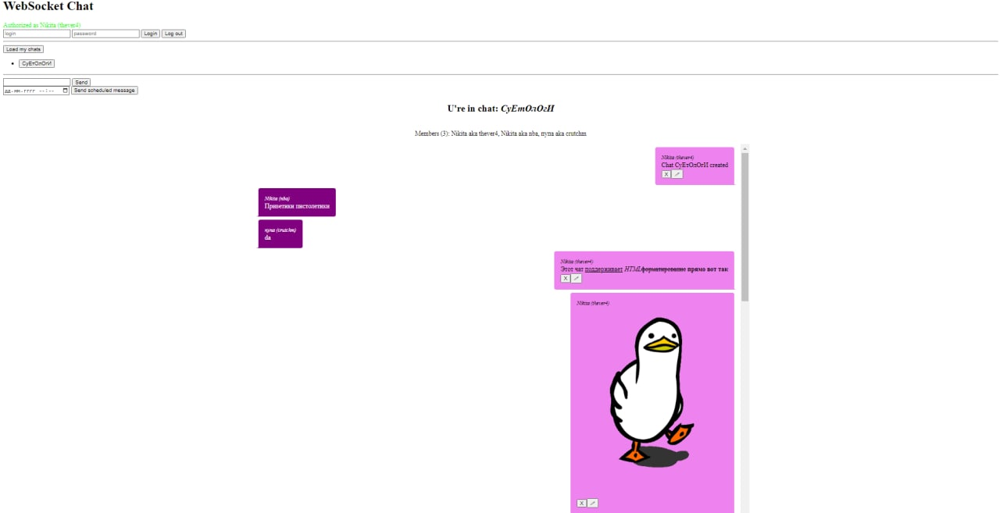
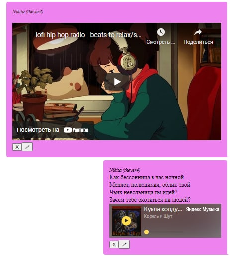

# Csu-Messenger


You need a Redis and some DBMS (etc. MySQL) instances to run this apps. They may be configured at `/core/db/session.py` and `/core/broker/redis.py`)

## This app allows you:
- Create a group chat
- Send scheduled messages (via Celery daemon)
- Messages with a lot of HTML formatting features (html markup, autogenerated hyperlinks, images from url, video from youtube and music from yandex.music)
- Chat in live time (Messages being received via WebSocket)
- _Extend it with your own features!_

To start the `messenger`, use this scripts
```sh
cd messenger
./run.sh
```

And if you need to process some links, mentions and hashtags, and more - the youtube and yandex.music widgets, enable another service in `postprocessor` directory
```sh
cd ../postprocessor
./run.sh
```


To stop, you can use following in each module:
```sh
./stop.sh
```
Also, recommended to stop Celery manually:
```
./kill_celery.sh
```

Also, application has little web-ui at [https://localhost:8080/utils/ws-page](https://localhost:8080/utils/ws-page)
and OpenAPI web-docs available [https://localhost:8080/docs](https://localhost:8080/docs)


## Some screenshots of this app


